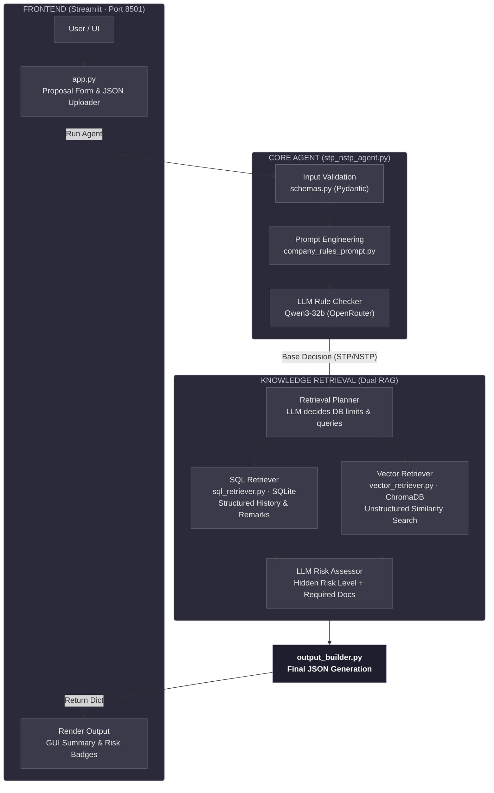

Here is a professional, comprehensive `README.md` for your **STP/NSTP Underwriting Agent**, structured exactly like your friend's document but tailored to your specific codebase, architecture, and files.

---

# 🛡️ Janashakthi STP/NSTP Underwriting Agent

An LLM-first, AI-driven decision engine for automated life insurance underwriting.

This agent receives verified proposal JSONs, evaluates them against **78 strict company rules** using advanced categorized prompting, and utilizes a **dual-database RAG architecture (SQL + Vector)** to detect hidden historical risks and recommend required medical documents.

---

## 📐 Architecture



---

## 🗂️ Project Structure

```text
STP_NSTP_Agent/
├── src/                              # Core Agent Source Code
│   ├── app.py                        # Streamlit web interface & UI rendering
│   ├── stp_nstp_agent.py             # Main agent orchestrator & LLM interaction
│   ├── company_rules_prompt.py       # 78 rules logic categorized to stop hallucination
│   ├── schemas.py                    # Pydantic validation (Input/Output shapes)
│   ├── sql_retriever.py              # Custom SQL tool for structured historical data
│   ├── vector_retriever.py           # ChromaDB semantic search for past evidence
│   ├── output_builder.py             # JSON formatting for GUI and Loading Agent
│   ├── utils.py                      # JSON extractors, text cleaners, keyword builders
│   └── config.py                     # Environment, paths, and status validation
│
├── database/                         # Structured Data
│   └── underwriting_system.db        # SQLite database (past proposals, underwriter remarks)
│
├── vector_store/                     # Unstructured Data
│   └── chroma_underwriting_.../      # ChromaDB embeddings (nomic-embed-text)
│
├── requirements.txt                  # Python dependencies
└── .env                              # API keys and environment variables

```

---

## 🧪 Verification Pipeline Flow

```text
[OCR Agent] passes Verified JSON Proposal
        │
        ▼
[Data Ingestion] schemas.py validates input strictly
        │
        ▼
[Categorized Prompting] company_rules_prompt.py splits 78 rules into:
  ├── FINANCIAL
  ├── MEDICAL
  └── NON-MEDICAL
        │
        ▼
[LLM Rule Engine] Checks rules without hallucination
  ├── Violates a rule? → Base Decision = NSTP
  └── All rules pass?  → Base Decision = STP
        │
        ▼
[RAG Retrieval Plan] LLM decides vector queries & SQL limits
  ├── SQL DB    → Fetches exact matches & similar demographic proposals
  └── Vector DB → Fetches semantically similar historical remarks
        │
        ▼
[Risk & Document Assessment] LLM analyzes RAG context
  ├── IF STP  → Assigns Hidden Risk Level (LOW / MEDIUM / HIGH)
  └── IF NSTP → Generates exact Required Medical/Financial Documents list
        │
        ▼
[Output Builder] Generates final JSON payload for the Loading Classifier Agent

```

---

## 🛠️ Technologies Used

### 🧠 AI / Machine Learning

| Technology | Version | Purpose |
| --- | --- | --- |
| **LangChain Core** | ≥ 0.2.0 | Orchestration & RAG tool integration |
| **LangGraph** | ≥ 0.2.0 | Workflow routing and agent state management |
| **Pydantic** | ≥ 2.0.0 | Strict JSON input/output schema validation |
| **OllamaEmbeddings** | ≥ 0.1.0 | Generates local embeddings via LangChain |
| **nomic-embed-text** | Local | Semantic embedding model for vector search |

### 🌐 LLM APIs (Cloud)

| Service | Models Used | Purpose |
| --- | --- | --- |
| **OpenRouter** | `qwen/qwen3-32b` | Primary reasoning LLM for rule checking & risk assessment |

### 💾 Databases & Data Processing

| Technology | Version | Purpose |
| --- | --- | --- |
| **SQLite3** | Native | Relational database for historical proposals & remarks |
| **ChromaDB** | ≥ 0.5.0 | Vector database for unstructured similarity search |
| **pandas** | ≥ 2.0.0 | SQL query formatting, dataframes, and data cleaning |

### 🖥️ Frontend & UI

| Technology | Version | Purpose |
| --- | --- | --- |
| **Streamlit** | ≥ 1.32.0 | Interactive GUI, rule visualization, and JSON form |

---

## ⚙️ Environment Variables

Create a `.env` file in the project root:

```env
# OpenRouter (Required for Agent Reasoning)
OPENROUTER_API_KEY=your_openrouter_api_key_here
OPENROUTER_MODEL=qwen/qwen3-32b   # Default model

# Embeddings
EMBEDDING_MODEL=nomic-embed-text

# Optional: Hardcode project directory (Code auto-detects if omitted)
# PROJECT_DIR=C:\path\to\your\project

```

---

## 🚀 Getting Started

### Local Development Setup

**1. Create a Python 3.10 Virtual Environment**

```bash
python -3.10 -m venv venv

```

**2. Activate the Environment**
*Windows:* `.\venv\Scripts\Activate.ps1`
*Mac/Linux:* `source venv/bin/activate`

**3. Install Dependencies**

```bash
python -m pip install --upgrade pip
pip install -r requirements.txt

```

**4. Start the Application**

```bash
streamlit run src/app.py --server.port 8501

```

*Note: Ensure your `database/` and `vector_store/` folders are present in the project root before running, or the app will flag missing runtime files.*

---

## 🔍 Logic & Rule Checking System

To prevent LLM hallucination, the agent uses a strict **Categorized Prompting Strategy**:

| Category | Checked Against | Example Rules |
| --- | --- | --- |
| **FINANCIAL** | `proposal_details`, `personal_details` | *Income to Sum Insured ratio (Rule 3), Auto UW Limits (Rule 10)* |
| **MEDICAL** | `medical_history`, `habits`, `physical_details` | *BMI ranges (Rule 22), Excessive Smoker (Rule 15)* |
| **NON-MEDICAL** | `personal_details`, `additional_questions` | *Hazardous Occupation (Rule 42), Age > 70 (Rule 48)* |

### The "Risky STP" Concept

A proposal might technically bypass all 78 hard rules, yielding a clean **STP** decision. However, the agent's **Phase 2 RAG Evaluation** scans historical data. If the clean proposal matches past cases that resulted in high claims or heavy underwriter scrutiny, it assigns a `MEDIUM` or `HIGH` **STP Risk Level**, alerting the business without breaking standard rule protocols.

---

## 📄 License

This project is developed for **Janashakthi Life Insurance** internal use.

---

*Built with ❤️ using LangChain · Streamlit · ChromaDB · OpenRouter*