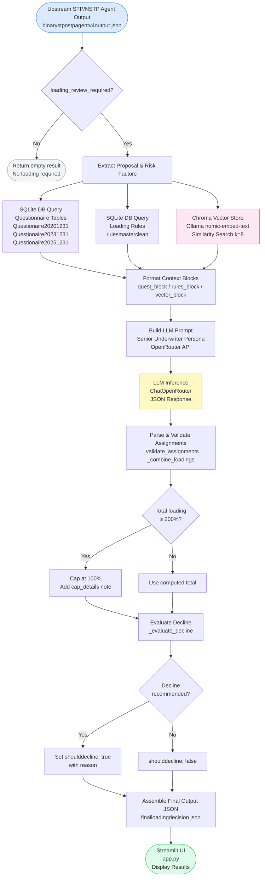

# Janashakthi Loading Agent

A RAG-powered, LLM-assisted premium loading assessment agent for life insurance underwriting at Janashakthi Insurance. The agent receives a flagged proposal from the upstream STP/NSTP decision agent and produces structured premium loading recommendations — including loading percentages, flat extras, and decline recommendations — backed by rule-based retrieval, vector search, and a senior underwriter–prompted LLM.

---

## Table of Contents

- [Overview](#overview)
- [System Architecture](#system-architecture)
- [How It Works](#how-it-works)
- [Components](#components)
- [Configuration](#configuration)
- [Input & Output](#input--output)
- [Loading Types](#loading-types)
- [Business Rules & Caps](#business-rules--caps)
- [Running the App](#running-the-app)
- [Project Structure](#project-structure)
- [Dependencies](#dependencies)

---

## Overview

The Loading Agent is the second stage in a two-stage underwriting pipeline. The first stage (`binary_stp_nstp_agent`) classifies a proposal as **STP** (Straight-Through Processing) or **NSTP** (Non-Straight-Through Processing). When a proposal is flagged with `loading_review_required: true`, the Loading Agent is invoked to determine whether — and how much — premium loading should be applied.

Loading is a premium surcharge applied to a policyholder's base premium to compensate the insurer for elevated risk. The agent identifies up to three loading types:

| Loading Type | Trigger |
|---|---|
| `HEALTH_LOADING` | Medical history, chronic illness, family health history |
| `LIFESTYLE_LOADING` | Smoking, alcohol consumption, hazardous hobbies |
| `OCCUPATION_LOADING` | High-risk or hazardous occupations |

---

## System Architecture



---

## How It Works

### Step 1 — Receive Upstream Decision

`run_loading_agent(stp_output)` is the single entry point. It accepts the full JSON output from the STP/NSTP agent. If `loading_review_required` is `false`, it immediately returns an empty result without calling the LLM.

### Step 2 — Extract Risk Context

The agent reads the following from the upstream payload:

- **Proposal summary** — proposal number, customer details, occupation, monthly income, sum insured
- **Risk flags** — `smoker_yes`, `alcohol_yes`, `hazardous_occupation_yes`, `hazardous_sport_yes`, `medical_review_required`, `high_risk_occupation_text`
- **Possible loading types** — pre-computed list from upstream (e.g. `["HEALTH_LOADING", "LIFESTYLE_LOADING", "OCCUPATION_LOADING"]`)
- **Violated rules** — rule IDs and descriptions that triggered the NSTP decision
- **Required medical reports** — list of medical evidence requested

### Step 3 — Retrieve Evidence (Three Sources)

| Source | Function | What it retrieves |
|---|---|---|
| **Questionnaire DB** | `_get_questionnaire_answers()` | Customer responses from 3 historical questionnaire tables |
| **Rules DB** | `_retrieve_loading_rules()` | Relevant rows from `rulesmasterclean` filtered by loading type and occupation keywords |
| **Vector Store** | `_retrieve_vector_docs()` | Top-8 semantically similar historical UW remarks via Chroma + Ollama embeddings |

### Step 4 — Build & Send LLM Prompt

A structured prompt is assembled via `_build_loading_prompt()`, adopting the persona of a senior life insurance underwriting specialist. The prompt includes:

- Upstream decision summary and risk flags
- Full proposal details
- Questionnaire evidence
- Retrieved loading rules
- Vector RAG evidence
- Strict JSON output schema

The LLM is called via **ChatOpenRouter** (configurable model, defaulting to `openrouter/owl-alpha`).

### Step 5 — Validate, Cap & Combine

- `_validate_assignments()` — Filters to valid loading types, deduplicates, clamps `loading_percentage` to `[0, 200]`
- `_combine_loadings()` — Sums all loading percentages (additive method); applies a **100% total cap** if exceeded
- `_evaluate_decline()` — Checks if the LLM recommended decline, if any rule has `suggested_decision = DECLINE`, or if total loading ≥ 200%

### Step 6 — Output

The final structured JSON is saved to `data/processed/agentoutputs/finalloadingdecision.json` and returned to the caller.

---

## Components

### `loading_agent-2.py` — Core Agent Logic

| Function | Purpose |
|---|---|
| `run_loading_agent(stp_output)` | Main entry point — orchestrates the entire pipeline |
| `_get_questionnaire_answers()` | Queries SQLite questionnaire tables by proposal/quote/member ID |
| `_retrieve_loading_rules()` | Retrieves relevant rules from `rulesmasterclean` by loading type and occupation |
| `_load_vector_store()` | Loads the Chroma vector store using config from `latestvectorstoreconfig.json` |
| `_retrieve_vector_docs()` | Runs semantic similarity search on the vector store |
| `_build_loading_prompt()` | Assembles the full LLM prompt with all evidence and output schema |
| `_validate_assignments()` | Validates, deduplicates, and clamps LLM loading assignments |
| `_combine_loadings()` | Sums loadings and applies the 100% business cap |
| `_evaluate_decline()` | Determines if a decline recommendation is warranted |
| `_safe_parse_json()` | Parses LLM response with fallback regex extraction |
| `_format_questionnaire()` | Formats questionnaire rows into a readable prompt block |
| `_format_rules()` | Formats DB rules into a readable prompt block |
| `_format_vector_docs()` | Formats vector documents into a readable prompt block |

### `app.py` — Streamlit UI

A wide-layout Streamlit dashboard with three sections:

1. **STP/NSTP Agent Output** — Load from file or paste JSON directly
2. **STP/NSTP Decision Summary** — Read-only view of decision, review flags, violated rules, and main reasons
3. **Premium Loading Assessment** — Run the loading agent and display assignments, breakdown per loading type, audit trail, and decline status

---

## Configuration

All configuration is resolved from environment variables (`.env` file in the project root) and path constants at the top of `loading_agent-2.py`.

| Variable | Default | Description |
|---|---|---|
| `OPENROUTER_API_KEY` | _(required)_ | API key for OpenRouter |
| `OPENROUTERMODEL` | `openrouter/owl-alpha` | LLM model to use |
| `DB_PATH` | `database/underwritingsystem.db` | Path to the SQLite underwriting database |
| `VECTOR_CONFIG` | `data/processed/latestvectorstoreconfig.json` | Path to Chroma vector store config |
| `OUTPUT_DIR` | `data/processed/agentoutputs/` | Directory for output JSON files |
| `MAX_SINGLE_LOADING` | `200` | Maximum allowed loading % per type |
| `TOTAL_LOADING_CAP` | `100` | Maximum combined loading % (business rule) |
| `COMBINATION_METHOD` | `ADDITIVE` | How loadings are combined |
| `VECTOR_K` | `8` | Number of vector documents to retrieve |

The vector store config (`latestvectorstoreconfig.json`) must contain:

```json
{
  "chromadir": "path/to/chroma",
  "collectionname": "underwritingknowledge",
  "embeddingmodel": "nomic-embed-text"
}
```

---

## Input & Output

### Input — STP/NSTP Agent JSON

The agent expects the full output from the upstream STP/NSTP agent. The key fields consumed are:

```json
{
  "reviewflags": { "loadingreviewrequired": true },
  "loadingagentinput": {
    "proposalsummary": { "proposalno": "...", "occupation": "...", "suminsured": "..." },
    "riskfactors": {
      "possibleloadingtypes": ["HEALTH_LOADING", "LIFESTYLE_LOADING", "OCCUPATION_LOADING"],
      "smokeryes": true,
      "alcoholyes": false,
      "hazardousoccupationyes": true,
      "medicalreviewrequired": true
    },
    "violatedrules": [...],
    "requiredmedicalreports": [...]
  }
}
```

### Output — Loading Decision JSON

```json
{
  "proposalreference": { "proposalno": "...", "quoteno": null, "memberid": null },
  "upstreamdecision": "NSTP",
  "loadingrequired": true,
  "loadingassignments": [
    {
      "loadingtype": "HEALTH_LOADING",
      "loadingpercentage": 25,
      "flatextraper1000": null,
      "reason": "Hypertension declared; visited doctor within 3 years.",
      "matchedruleid": "MEDICAL_014",
      "matchedruledescription": "ADVERSE FAMILY HISTORY",
      "supportingevidence": {
        "questionnaireitems": [...],
        "vectordocs": [...],
        "similarcases": [...]
      },
      "confidence": "HIGH"
    }
  ],
  "totalloadingpercentage": 50,
  "combinationmethod": "ADDITIVE",
  "capapplied": false,
  "capdetails": null,
  "declinerecommendation": { "shoulddecline": false, "reason": "" },
  "importantnote": "...",
  "audittrail": {
    "timestamp": "2026-06-04T16:35:00+00:00",
    "modelused": "openrouter/owl-alpha",
    "prompthash": "a1b2c3d4e5f6a7b8",
    "promptchars": 4200,
    "parseerror": null,
    "version": "2.0.0"
  },
  "evidencesummary": {
    "questionnairerotscount": 3,
    "loadingrulescount": 12,
    "vectordocscount": 8
  }
}
```

---

## Loading Types

| Type | Description | Common Triggers |
|---|---|---|
| `HEALTH_LOADING` | Elevated health risk | Chronic illness, positive family history, medical history declared, doctor visits |
| `LIFESTYLE_LOADING` | Elevated lifestyle risk | Smoking (>21 sticks/week), alcohol (hard >1.5L/month, wine >5 bottles, beer >20 bottles), hazardous hobbies |
| `OCCUPATION_LOADING` | Elevated occupational risk | Hazardous occupations (heavy vehicle drivers, miners, construction workers, electricians in high-voltage environments) |

---

## Business Rules & Caps

- **Maximum single loading:** 200% per loading type (clamped automatically)
- **Total combined loading cap:** 100% (additive; if exceeded, total is capped and `cap_details` is populated)
- **Decline threshold:** If combined loading ≥ 200%, or if a rule explicitly carries `suggested_decision = DECLINE`, or if the LLM recommends decline, `should_decline` is set to `true`
- **Deduplication:** Only one entry per loading type is allowed in the output
- **No rule invention:** The LLM is explicitly instructed to reference only rules provided in the prompt context; `matched_rule_id` must reference an actual rule ID from the retrieved rules

---

## Running the App

### Prerequisites

```bash
pip install streamlit langchain-chroma langchain-ollama langchain-openrouter pandas python-dotenv
```

Ollama must be running locally with the `nomic-embed-text` model pulled:

```bash
ollama pull nomic-embed-text
```

### Environment Setup

Create a `.env` file in the project root:

```env
OPENROUTER_API_KEY=your_api_key_here
OPENROUTERMODEL=openrouter/owl-alpha
```

### Launch the Streamlit App

```bash
streamlit run app.py
```

### Run the Agent Directly (Python)

```python
import json
from src.loading_agent import run_loading_agent

with open("data/processed/agentoutputs/binarystpnstpagentv4output.json") as f:
    stp_output = json.load(f)

result = run_loading_agent(stp_output)
print(result)
```

---

## Project Structure

```
project-root/
├── app.py                              # Streamlit UI
├── src/
│   └── loading_agent-2.py             # Core loading agent logic
├── database/
│   └── underwritingsystem.db          # SQLite database (rules + questionnaires)
├── data/
│   └── processed/
│       ├── latestvectorstoreconfig.json
│       └── agentoutputs/
│           ├── binarystpnstpagentv4output.json   # Upstream STP/NSTP output (input)
│           └── finalloadingdecision.json          # Loading agent output
├── vectorstore/                        # Chroma vector store directory
└── .env                               # API keys and model configuration
```

---

## Dependencies

| Package | Purpose |
|---|---|
| `streamlit` | Web UI |
| `langchain-chroma` | Chroma vector store integration |
| `langchain-ollama` | Local Ollama embeddings (`nomic-embed-text`) |
| `langchain-openrouter` | LLM inference via OpenRouter API |
| `pandas` | Data handling and SQLite query results |
| `python-dotenv` | Environment variable loading |
| `sqlite3` | Built-in Python SQLite access |

---

> **Version:** 2.0.0 | **Insurer:** Janashakthi Insurance
